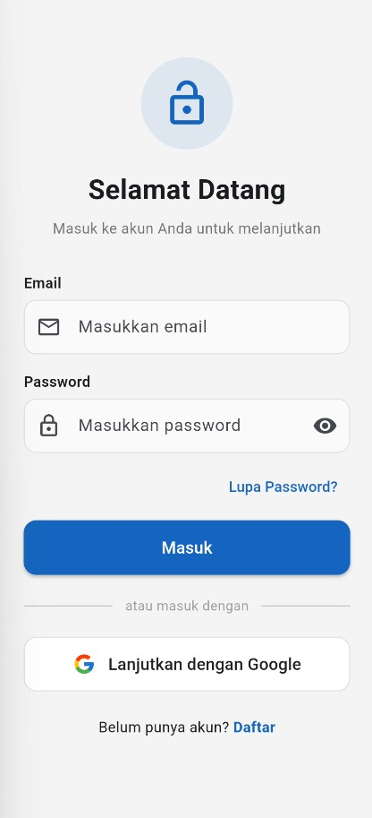
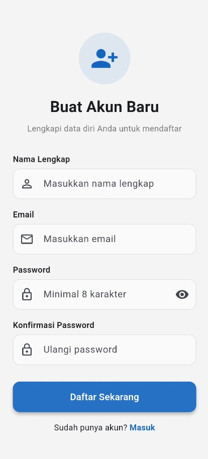
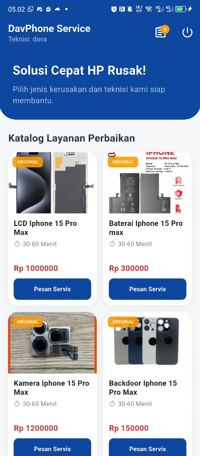
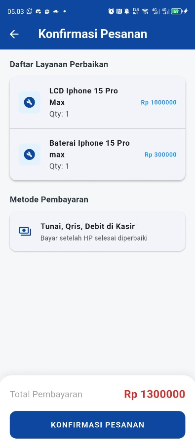

# 🛠️ SERVICE STORE

> **UTS Mobile Programming**

---

## 📱 Demo Aplikasi

> 🎥 **Video Demo YouTube:** [On Progress]

> **Nama : Dava Ananda Wahyudi**
> 
> **NIM  : 1123150164**

---

## 📱 Deskripsi Aplikasi

**DavPhone Service** adalah solusi digital untuk manajemen perbaikan smartphone. Aplikasi ini memudahkan teknisi dan pelanggan dalam mengelola antrean servis, transparansi harga, dan pelacakan status perbaikan dalam satu platform yang modern.

---

### 🚀 Fitur Utama
* **🔒 Secure Auth**: Login aman dengan Firebase & sinkronisasi Backend JWT.
* **🔧 Service Catalog**: Daftar layanan perbaikan dengan estimasi waktu & harga transparan.
* **🛒 Smart Cart**: Kelola beberapa pesanan servis sekaligus dengan kontrol kuantitas.
* **📑 Order Confirmation**: Alur checkout yang bersih dengan notifikasi status berhasil.
* **📡 Dio Interceptor**: Penanganan API otomatis, penyuntikan token, dan auto-logout (401).

---

### 🛠️ Tech Stack
| Component | Technology |
|---|---|
| **Framework** | Flutter 💙 |
| **State Management** | Provider ⚡ |
| **Network Client** | Dio with Interceptors 📡 |
| **Storage** | Flutter Secure Storage 🔒 |
| **Backend** | Firebase Auth & Golang Backend ⚙️ |

---

### 📸 Dokumentasi Aplikasi (Gallery)

Berikut adalah alur penggunaan aplikasi DavPhone Service dari awal hingga proses checkout:

| Login | Register | Verifikasi Email |
|:---:|:---:|:---:|
|  |  |  |

| Verifikasi Link Email | Verifikasi Email Berhasil | Pilih Akun Google |
|:---:|:---:|:---:|
|  |  |  |

| Reset Password | Loading Login | Dashboard |
|:---:|:---:|:---:|
|  |  |  |

| Pop-up Pemesanan | Keranjang | Checkout |
|:---:|:---:|:---:|
|  |  |  |

| Checkout Berhasil |
|:---:|
|  |
---
A new Flutter project.

## Getting Started

This project is a starting point for a Flutter application.

A few resources to get you started if this is your first Flutter project:

- [Lab: Write your first Flutter app](https://docs.flutter.dev/get-started/codelab)
- [Cookbook: Useful Flutter samples](https://docs.flutter.dev/cookbook)

For help getting started with Flutter development, view the
[online documentation](https://docs.flutter.dev/), which offers tutorials,
samples, guidance on mobile development, and a full API reference.
